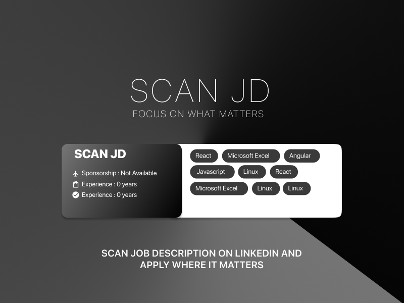
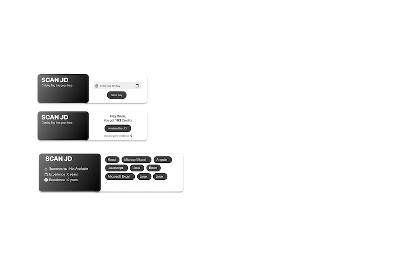
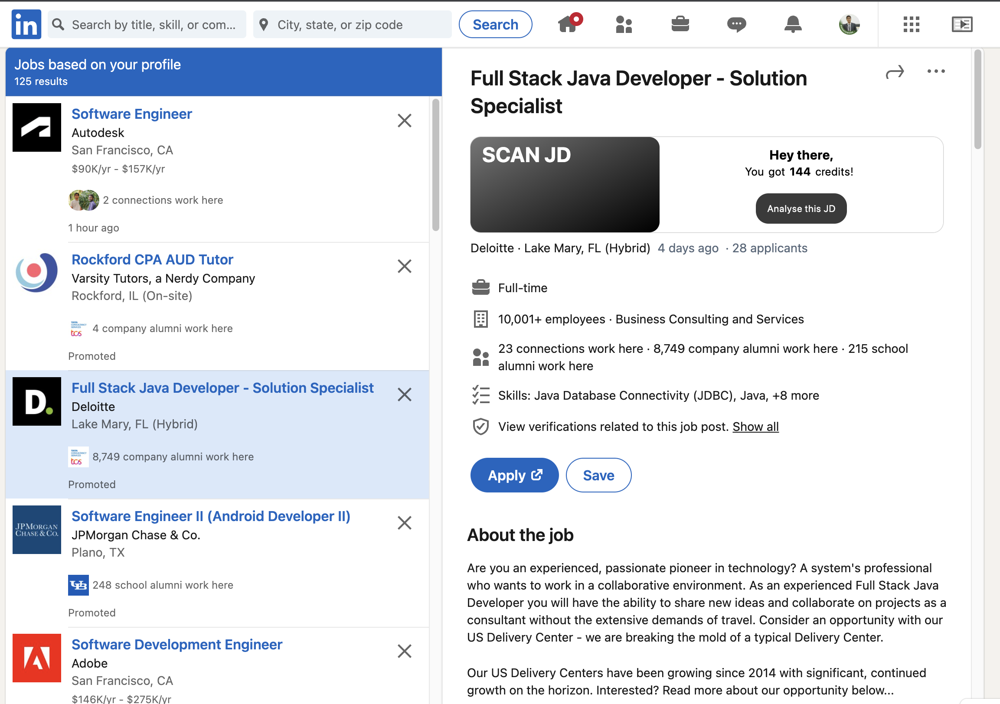

# Scan JD - Chrome Extension Job Description Analyzer

Scan JD is a powerful Chrome extension designed to elevate your job search experience on LinkedIn. This tool efficiently scans job descriptions and delivers concise results directly on the page, streamlining your job search process.

## Key Features:

- **Efficient Job Search:** Enhance your job search efficiency by quickly analyzing job descriptions without leaving the LinkedIn page.

- **Real-time Results:** Instantly view key metrics and insights extracted from job descriptions directly on the LinkedIn interface.

- **ChatGPT Integration:** Employs ChatGPT's API in the backend for advanced job description analysis, utilizing sophisticated Prompt engineering techniques.

## Mockups




[](https://clipchamp.com/watch/U7iRy48gvBT)

## How it Works:

1. **Seamless Integration:** The Chrome extension seamlessly integrates with LinkedIn, providing a hassle-free experience.

2. **Backend Powered by ChatGPT:** Leveraging ChatGPT's API ensures accurate and insightful job description analysis.

3. **Concise Presentation:** Receive clear and concise results, allowing you to make informed decisions about potential job opportunities.

## Installation:

1. Clone the repository.
    ```bash
    git clone https://github.com/patel-dhaval/ScanJD.git
    ```

2. Install the Chrome extension.
    - Open Chrome and navigate to `chrome://extensions/`.
    - Enable Developer mode.
    - Click on "Load unpacked" and select the extension folder.

3. Start using Scan JD on LinkedIn to optimize your job search process.

## Contribution:
[@patel-dhaval](https://github.com/patel-dhaval)
[@kashyapsoni3010](https://github.com/kashyapsoni3010)
[@namankhurpia](https://github.com/namankhurpia)

## Credits:

This project is powered by ChatGPT's API, contributing to the seamless analysis of job descriptions.

## Troubleshooting
For any errors, kindly contact dhavalja@buffalo.edu
